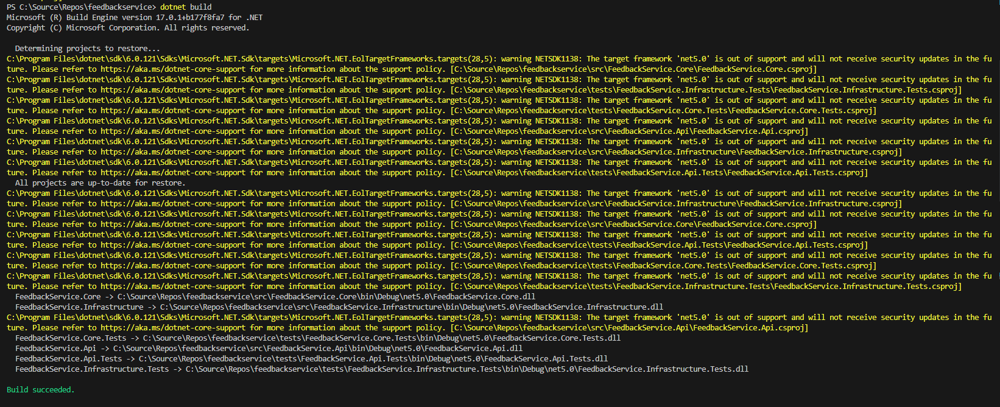
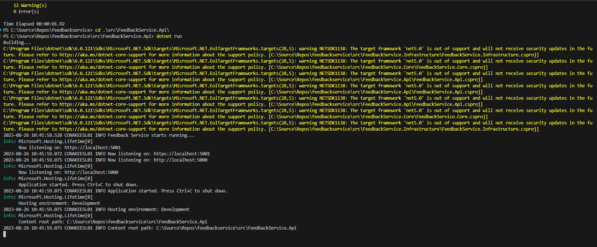
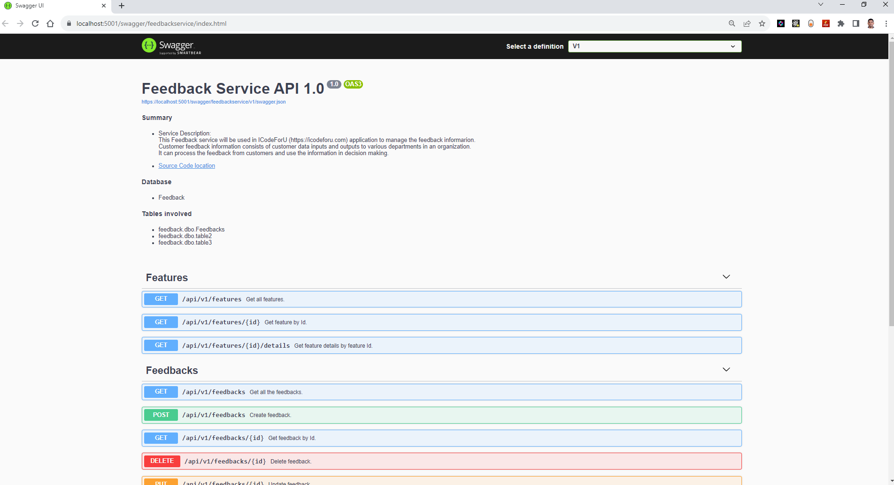

# Introduction 

Welcome to the world of the .NET Core Web API project! This project is part of the 'Clean Architecture Step by Step Practical Guide'.

If you're new to .NET Core Web API, don't worry at all. This project is designed to be your starting point. Here, you'll learn how to create 'RESTful API' using the latest version of ASP.NET Core, which is known as .NET 6.

Imagine this project as your developer guide to become a .NET Core backend developer in the world of Microsoft technology. 

You will also learn Entity Framework Core, a powerful tool that helps your projects talk to databases. So, whether you're a beginner or just want to level up your skills, this project has got your back. 

# Build and Test

Here are the steps to build and run a .NET Core Web API project locally:

**Install .NET Core SDK:**

Make sure you have the .NET Core SDK installed on your computer. You can download it from the official .NET Core website.

**Clone the Project:**

Open your terminal or command prompt and navigate to the directory where you want to clone the project. Use the following command to clone this .NET Core Web API project:

```
git clone https://github.com/akeesari/feedbackservice
```

**Navigate to Project Directory:**

Change your working directory to the newly created project:

```
cd feedbackservice
```

**Build the Project:**

Build the project using the following command:
```
dotnet build
```



**Run the Project:**

Run your .NET Core Web API using the following command:

```
cd .\src\FeedbackService.Api\
dotnet run
```


**Access the API:**

Your API should now be running locally. Open your web browser or API testing tool and access the following URL:

https://localhost:5001/swagger/feedbackservice/index.html




**Test Endpoints:**

select the endpoint you want to test from swagger UI and click on `try it out` button.

# Contribute

If you want to learn more about creating good readme files then refer the following [guidelines](https://docs.microsoft.com/en-us/azure/devops/repos/git/create-a-readme?view=azure-devops). You can also seek inspiration from the below readme files:
- [ASP.NET Core](https://github.com/aspnet/Home)
- [Visual Studio Code](https://github.com/Microsoft/vscode)
- [Chakra Core](https://github.com/Microsoft/ChakraCore)